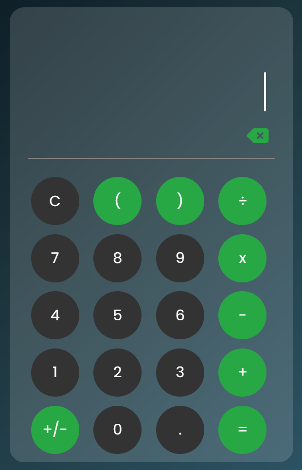

<!DOCTYPE html>
<html lang="en">
<head>
    <meta charset="UTF-8">
    <meta name="viewport" content="width=device-width, initial-scale=1.0">
</head>
<body>
    <h1>🖥️ Web Calculator</h1>
    
A responsive web-based calculator built with <strong>HTML, CSS, and JavaScript</strong>.  
    Supports both <strong>mouse clicks 🖱️</strong> and <strong>keyboard input ⌨️</strong>.

<h2>✨ Features</h2>
    <ul>
        <li>Basic arithmetic: ➕ ➖ ✖️ ➗</li>
        <li>Sign toggle (+/-) 🔄</li>
        <li>Decimal support (.) 🔢</li>
        <li>Clear (C) 🧹 and backspace ⌫</li>
        <li>Keyboard support ⌨️</li>
        <li>Responsive layout for desktop 🖥️ and mobile 📱</li>
        <li>Modern glass UI with blinking caret ✨</li>
    </ul>
<h2>📷 Preview</h2>

Link to the Calculator : https://calculator-web-app-sandy.vercel.app/

     

<h2>💻 How to Use</h2>
    <ol>
        <li>Clone the repo:
             <code>git clone https://github.com/yourusername/web-calculator.git</code>
        </li>
        <li>Open <code>index.html</code> in a browser</li>
        <li>Click buttons or use your keyboard</li>
        <li><code>C</code> to clear, <code>Backspace</code> to delete, <code>=</code> or <code>Enter</code> to calculate</li>
    </ol>

<h2>🛠️ Technologies Used</h2>
    <ul>
        <li>HTML5</li>
        <li>CSS3 (Flexbox & Grid, Glassmorphism)</li>
        <li>JavaScript (DOM & events)</li>
        <li>Google Fonts: Poppins</li>
        <li>Font Awesome icons</li>
    </ul>

<h2>📌 License</h2>
    
“This project is open and free to use for personal or educational purposes.” ✅

</body>
</html>
